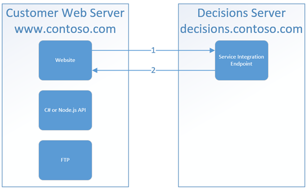

# Decisions-CORS-Proxy
Proxy CORS requests to Decisions API Endpoints

This repository is intended specifically for use with the Decisions Workflow system (http://www.decisions.com), but it could be extended out to other systems with fairly easy effort. All code is in C# and is geared towards ASP.NET Web API 2 technology.  However, if you have another technology of choice (Node.js, PHP, Java, etc), you could adapt it for your use.

The goal of this is to allow you to avoid having CORS issues when using your own front end webserver to make calls to the Decisions server API endpoints.  There are two projects in this repository:
  1.  A full blown ASP.NET Web API 2 project with included webpages.
  2.  A minimum ASP.NET Web API 2 project with just what you need to deploy without all the extra webpage technology needed.

You will need to edit the web.config and give the proxy:
  1. A Decisions Session ID that you setup for use to call Decisions API endpoints.
  2. A Decisions server URL.  Edit the url provided and change the host/domain information.


#### Summary of the CORS issue with Decisions and discussion of the workaround

Without the workaround, the information flow looks like this:



1.	User requests page from www.contoso.com.
  2.  Page has code that causes it to go get data located at a Decisions Service Integration Endpoint on decisions.contoso.com
  3.  Browser recognizes that the Decisions server is on a different server so it kicks into CORS mode. 
  4.  Browser sends an OPTIONS header to decisions.contoso.com
5.  decisions.contoso.com responds with a 405 since it’s not configured for CORS

------

The choices here are:
  1.  Configure the Decisions server to use CORS.
    2.  This requires editing of web.config and possibly Global.asax.cs file (which means recompile of dll’s) to make happen.  Since you're a customer, you can't do this.  Decisions themselves would have to add support for configuring this directly into their product.
    3.	Best practice says to configure the server to only accept CORS requests from a single host.  You can use a wildcard to allow any host, but this is a potential security issue.  If we configure this based on best practice, then a particular Decisions server will only ever be able to be accessed from a single external server.  This limits the customer from potentially using multiple external servers to hit a single Decisions server install.
  4.	Implement a CORS Proxy via your favorite language:  C#, node.js, Java, PHP, etc.
    5.	This does bypass the browser’s built in protection that keeps untrusted web servers from automatically sending and receiving data to the browser.
    6.	Diagram of workaround below.


  1.  User requests page from www.contoso.com
    2.  Page has code on it that causes it to think there is a data it needs located on the local server via an API technology.  (WCF, Web API 2, node.js, PHP, etc).
    3.	GET request would look something like this:  https://www.contoso.com/api/corsproxy/get?flowid=f56e8777-3ca1-11e6-80d3-005056b734e6&Action=api&outputType=json&options=
        4	The `options` parameter is there in case we need to pass multiple parameters all the way through to Decisions.  The API code checks to see if ‘options’ is null.  If so, it just carries on and then makes the request to the Decisions server.  If it’s not null, then it appends the options parameter string onto the URL for the Decisions server.
        5.  For example, if the actual Decisions endpoint GET request should look like this:  https://decisions.contoso.com/Primary/?FlowId=43c92f63-ec64-11e5-80d3-665056b734e6&Action=api&sessionid=NS-g8g4c689-a713-11f5-80f1-0050563734e6&outputtype=JSON&ReportName=null&ConditionString=null&ColumnString=null&APIEndpoint=null, then our request from www.contoso.com to its internal CORS proxy endpoint, would like this:  (https://www.contoso.com/api/corsproxy/get?flowid=f56e8777-3ca1-11e6-80d3-005056b734e6&Action=api&outputType=json&options=ReportName%3Dnull%26%26ConditionString%3Dnull%26%26ColumnString%3Dnull%26%26APIEndpoint%3Dnull)
        6.	The CORS proxy API code will then properly treat the options parameter as one giant string and not try to break it apart into multiple parameters.
        7.  I do recognize this seems a bit of a hack, but it’s a limitation of the GET standard in conjunction with Web API 2 and possibly WCF, node.js, etc.  It’s hard to have a GET endpoint work with what is essentially a dynamic, unknown parameter at runtime.
    8.	POST request URL would be https://www.contoso.com/api/corsproxy/post and would send in a json object that looks like this:
    
        ```json
        "sessionid": "",
        "outputtype": "json",
        "flowId": "f56e8777-3ca1-11e6-80d3-005056b734e6"
        ```

        9.  Notice there isn't an options object in the JSON.  There really is no need with a POST request as you would just add any objects you normally would in a POST request to a Decisions server and the local API endpoint code just passes it one to Decisions and things operate as normal.
        10. Also notice that the ‘SessionId’ value is null.  This is because we’re storing that value in the web.config on the server so that it never shows up in the client code.  This value could be passed in from the client if desired.  It’s really up to the developer as to whether they want that GUID to show up somewhere in client accessible code.
        
  11. Based on the request that comes in, the CORS proxy endpoint code will then take the data that comes in on the request and parse it.
    12.	API code then constructs the actual request that will be sent on Decisions.  In my case, I’m doing everything through JSON, but there is probably a way to make this dynamic enough to accept in XML as well and have the code branch as necessary to different functions.
  13.	Decisions server receives request and processes as normal and returns whatever data would normally be returned back to the requesting API.
  14.	API then passes that data back to the browser.
